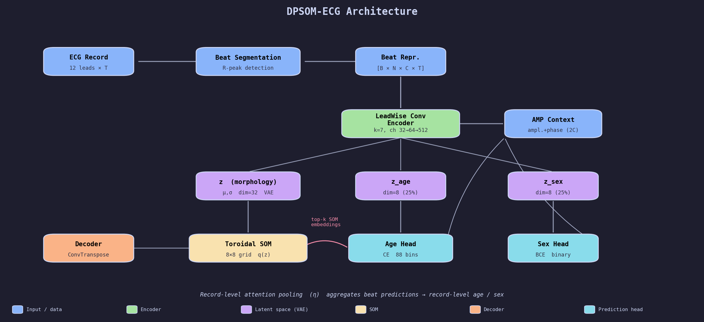
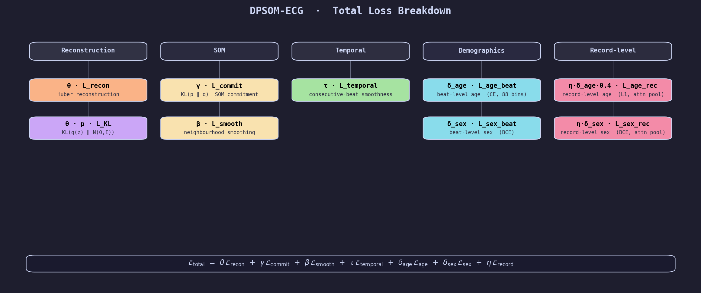
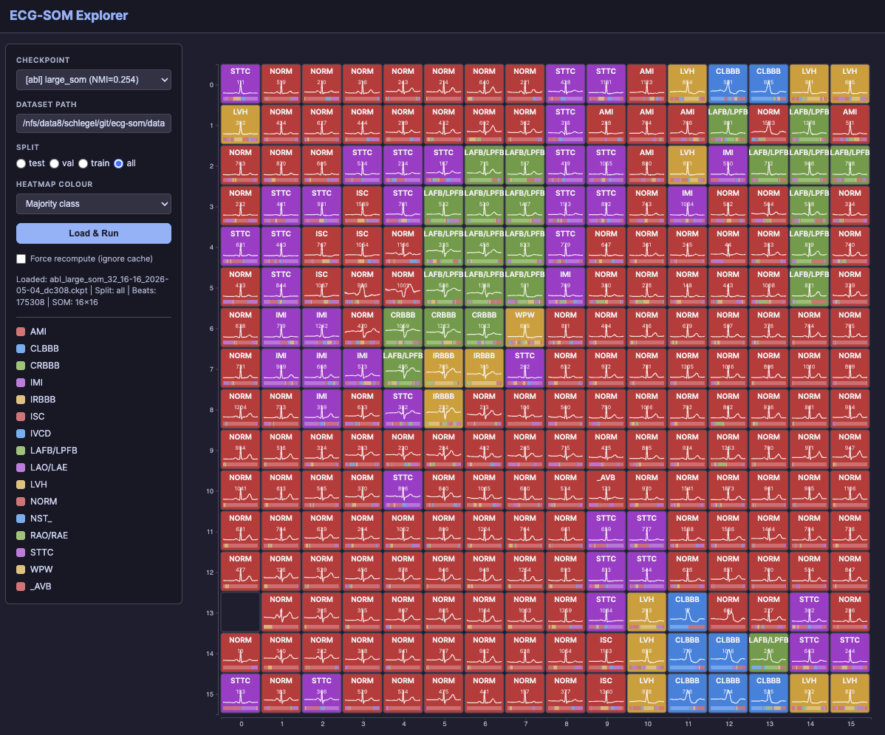

# ecg-som

Disentangled representation learning for ECG signals using a DPSOM (Deep Probabilistic Self-Organizing Map) architecture on the PTB-XL dataset.

The model learns a morphology latent space (z) that drives SOM assignments, while separate demographic encoders (z_age, z_sex) disentangle age and sex from the morphology representation. A disease-conditioned age-correction module further refines the latent space using top-k SOM node embeddings.





## Repository structure

```text
ecg-som/
├── src/                        # Main project code
│   ├── config.py               # Hyperparameters and configuration
│   ├── scheduler.py            # Exponential decay LR scheduler
│   ├── model/
│   │   ├── dpsom.py            # DPSOM-ECG model (toroidal SOM, disentanglement, age correction)
│   │   ├── codec.py            # Lead-wise convolutional encoder / decoder
│   │   └── layers.py           # Shared building blocks (SE block, FiLM, etc.)
│   ├── data/
│   │   ├── dataset.py          # PTB-XL dataset loading, preprocessing, splits
│   │   ├── generator.py        # Batch and record-level data generators
│   │   ├── ptbxl.py            # PTB-XL specific import helpers
│   │   ├── record.py           # Per-record ECG processing and beat segmentation
│   │   └── signal.py           # Low-level signal utilities
│   ├── training/
│   │   └── trainer.py          # Training, evaluation and checkpoint routines
│   └── utils/
│       ├── metrics.py          # Cluster purity, disentanglement metrics
│       └── visualization.py    # SOM visualisation helpers
├── explorer/                   # Interactive result explorer (FastAPI + D3)
│   ├── server.py               # Backend entry point
│   └── static/                 # Frontend assets
├── ablation/                   # Ablation study scripts and results
│   ├── ablation.py             # Ablation variants and runner (uses src/)
│   ├── run_ablation_parallel.sh# Parallel multi-GPU ablation launcher
│   ├── merge_ablation_results.py
│   └── ablation_results*.csv/json
├── logs/                       # Training/evaluation output artifacts (not versioned)
├── models/                     # Saved model checkpoints (not versioned)
├── DisentangledECG/            # Legacy prototype code (superseded by src/)
└── README.md
```

## Quick start

```bash
# from repo root
python -m venv .venv && source .venv/bin/activate
pip install -r DisentangledECG/requirements.txt

# train with default config
python -c "from src.training.trainer import main; main()"
```

## Explorer

An interactive SOM explorer is available as a FastAPI + D3 web app:

```bash
python explorer/server.py [--port 8050] [--host 0.0.0.0]
```

Open `http://localhost:8050` in a browser to browse SOM nodes, inspect ECG beats, and explore latent-space structure.



## Ablation studies

> The figures above are generated by `src/utils/make_figures.py`.

```bash
# run all ablation variants in parallel across 4 GPUs
bash ablation/run_ablation_parallel.sh

# or run specific variants
python ablation/ablation.py --variants baseline no_temporal no_disentangle
```

Results are written to `ablation/ablation_results*.csv/json` and merged into `ablation_results_all.csv`.
The notebook `ablation/ablation_exploration.ipynb` visualises all results interactively.

### Results summary

All 48 ablation variants completed successfully on PTB-XL test split.

| Metric | Meaning | Direction |
|--------|---------|-----------|
| NMI | Normalised Mutual Information (cluster ↔ disease label) | ↑ better |
| AMI | Adjusted Mutual Information | ↑ better |
| Purity | Majority-class fraction per SOM node | ↑ better |
| MAE Age | Mean absolute error for age regression (years) | ↓ better |
| AUC Sex | AUROC for sex classification | ↑ better |

**Baseline (8×8 SOM):** NMI = 0.208 · AMI = 0.200 · Purity = 0.538 · MAE Age = 7.78 · AUC Sex = 0.901

### Loss-term ablations

Removing individual loss components from the full model.

| Variant | Removed / changed | NMI | AMI | Purity | MAE Age | AUC Sex |
|---|---|---|---|---|---|---|
| **baseline** | — | **0.208** | **0.200** | **0.538** | 7.78 | **0.901** |
| no_kl | γ = 0 (no KL regularisation) | 0.000 | 0.000 | 0.449 | 7.71 | 0.896 |
| no_som_smooth | α = 0 (no SOM neighbourhood smoothing) | 0.141 | 0.133 | 0.492 | 7.69 | 0.894 |
| no_temporal | τ = 0 (no temporal beat-sequence loss) | 0.178 | 0.169 | 0.526 | 7.73 | 0.898 |
| no_som_commit | β = 0 (no SOM commitment loss) | 0.205 | 0.197 | 0.529 | 7.65 | 0.899 |
| no_record_attn | η = 0 (no record-level attention pooling) | 0.206 | 0.198 | 0.544 | 7.56 | 0.898 |
| no_disentangle | δ_age = δ_sex = 0 (no disentanglement) | 0.198 | 0.189 | 0.534 | 19.60 | 0.385 |
| no_age | δ_age = 0 (age encoder disabled) | 0.202 | 0.194 | 0.535 | 19.14 | 0.901 |
| no_sex | δ_sex = 0 (sex encoder disabled) | 0.213 | 0.205 | 0.546 | 7.66 | 0.648 |
| no_age_corr | λ_max = 0 (age-correction module off) | 0.200 | 0.192 | 0.538 | 7.51 | 0.902 |

Key findings:
- **KL regularisation is essential** — removing it (no_kl) collapses NMI to 0.
- **Disentanglement is critical for demographics** — no_disentangle raises MAE Age from 7.8 to 19.6 years and destroys sex AUC (0.385). The individual terms confirm age and sex encoders each contribute independently.
- **Temporal smoothing matters most for clustering** — no_temporal is the largest drop in NMI among soft ablations (−0.030).
- **SOM neighbourhood smoothing (α) is important** — setting α = 0 drops NMI by −0.067.

### Architecture ablations

#### SOM size

| Variant | Grid | NMI | AMI | Purity | MAE Age | AUC Sex |
|---|---|---|---|---|---|---|
| small_som | 4×4 | 0.129 | 0.126 | 0.480 | 7.67 | **0.905** |
| **baseline** | **8×8** | **0.208** | **0.200** | **0.538** | 7.78 | 0.901 |
| large_som | 16×16 | **0.254** | **0.228** | **0.575** | **7.61** | 0.896 |

A 16×16 SOM improves NMI by +0.046 and purity by +0.037. A 4×4 grid is significantly worse, showing the model needs sufficient resolution to separate disease sub-types.

#### Latent dimensionality

| Variant | z_dim | NMI | AMI | Purity | MAE Age | AUC Sex |
|---|---|---|---|---|---|---|
| small_latent | 16 | 0.196 | 0.188 | 0.537 | **7.52** | 0.902 |
| **baseline** | **32** | **0.208** | **0.200** | **0.538** | 7.78 | **0.901** |
| large_latent | 64 | 0.204 | 0.195 | 0.538 | 7.62 | 0.898 |

The model is not very sensitive to latent dimensionality; 32 dimensions is a good default.

#### Encoder width

| Variant | channels | NMI | AMI | Purity | MAE Age | AUC Sex |
|---|---|---|---|---|---|---|
| narrow_encoder | 16 / 32 | 0.195 | 0.187 | 0.536 | 7.88 | 0.898 |
| **baseline** | **32 / 64** | **0.208** | **0.200** | **0.538** | 7.78 | 0.901 |
| wide_encoder | 64 / 128 | 0.205 | 0.197 | 0.532 | **7.55** | **0.902** |

#### FC hidden dimension

| Variant | fc_dim | NMI | AMI | Purity | MAE Age | AUC Sex |
|---|---|---|---|---|---|---|
| small_fc | 256 | 0.200 | 0.191 | 0.530 | 7.63 | 0.895 |
| **baseline** | **512** | **0.208** | **0.200** | **0.538** | 7.78 | **0.901** |
| large_fc | 1024 | 0.210 | 0.202 | 0.539 | 7.64 | 0.899 |

#### Convolutional kernel size

| Variant | kernel | NMI | AMI | Purity | MAE Age | AUC Sex |
|---|---|---|---|---|---|---|
| small_kernel | 3 | 0.203 | 0.194 | **0.540** | 7.73 | 0.903 |
| **baseline** | **7** | **0.208** | **0.200** | 0.538 | 7.78 | 0.901 |
| large_kernel | 11 | 0.190 | 0.181 | 0.530 | **7.54** | **0.904** |

#### Age latent fraction

| Variant | z_age / z (fraction) | NMI | AMI | Purity | MAE Age | AUC Sex |
|---|---|---|---|---|---|---|
| small_age_latent | 0.125 | 0.205 | 0.196 | **0.539** | 7.59 | 0.896 |
| **baseline** | **0.25** | **0.208** | **0.200** | 0.538 | 7.78 | **0.901** |
| large_age_latent | 0.5 | 0.202 | 0.194 | 0.535 | 7.71 | 0.897 |

### Age-correction module

| Variant | Description | NMI | AMI | Purity | MAE Age | AUC Sex |
|---|---|---|---|---|---|---|
| no_age_corr | λ_max = 0 (correction disabled) | 0.200 | 0.192 | 0.538 | **7.51** | 0.902 |
| less_topk | top-k = 2 | 0.214 | 0.206 | **0.546** | 7.66 | 0.902 |
| **baseline** | **top-k = 4, ramp = 10 ep** | **0.208** | **0.200** | 0.538 | 7.78 | 0.901 |
| more_topk | top-k = 8 | 0.198 | 0.190 | 0.531 | 7.66 | 0.900 |
| fast_ramp | ramp = 3 epochs | 0.204 | 0.196 | 0.544 | 7.64 | 0.899 |
| slow_ramp | ramp = 20 epochs | 0.204 | 0.196 | 0.537 | 7.62 | **0.904** |

Using fewer top-k nodes (2 instead of 4) slightly improves NMI and purity, suggesting a sparser correction is preferable.

### Hyperparameter sweeps

#### Loss weights

| Variant | Parameter | Value | NMI | AMI | Purity | MAE Age | AUC Sex |
|---|---|---|---|---|---|---|---|
| alpha_low | α (SOM smoothing) | 1.0 ↓ | 0.140 | 0.132 | 0.491 | 7.58 | 0.896 |
| **baseline** | α | **10.0** | **0.208** | **0.200** | **0.538** | 7.78 | **0.901** |
| alpha_high | α | 50.0 ↑ | 0.193 | 0.184 | 0.525 | 7.64 | 0.894 |
| beta_low | β (commitment) | 0.05 ↓ | 0.212 | 0.204 | 0.539 | 7.70 | 0.902 |
| **baseline** | β | **0.5** | **0.208** | **0.200** | **0.538** | 7.78 | **0.901** |
| beta_high | β | 5.0 ↑ | 0.193 | 0.184 | 0.530 | 7.59 | 0.896 |
| gamma_low | γ (KL weight) | 1.0 ↓ | 0.153 | 0.150 | 0.480 | 7.70 | 0.893 |
| **baseline** | γ | **10.0** | **0.208** | **0.200** | **0.538** | 7.78 | **0.901** |
| gamma_high | γ | 50.0 ↑ | 0.196 | 0.188 | 0.534 | 7.75 | 0.895 |
| tau_low | τ (temporal) | 0.2 ↓ | 0.188 | 0.179 | 0.524 | 7.57 | 0.896 |
| **baseline** | τ | **1.6** | **0.208** | **0.200** | **0.538** | 7.78 | **0.901** |
| tau_high | τ | 8.0 ↑ | 0.204 | 0.195 | 0.537 | 7.64 | 0.894 |
| theta_low | θ (neighbourhood) | 0.01 ↓ | 0.199 | 0.191 | 0.533 | 7.60 | **0.905** |
| **baseline** | θ | **0.1** | **0.208** | **0.200** | **0.538** | 7.78 | 0.901 |
| theta_high | θ | 1.0 ↑ | 0.189 | 0.181 | 0.523 | 7.69 | 0.902 |
| eta_low | η (record attn) | 0.1 ↓ | 0.201 | 0.192 | 0.535 | 7.67 | 0.901 |
| **baseline** | η | **1.0** | **0.208** | **0.200** | **0.538** | 7.78 | **0.901** |
| eta_high | η | 5.0 ↑ | 0.197 | 0.189 | 0.533 | 7.65 | 0.896 |

The model is most sensitive to α (SOM smoothing) and γ (KL weight) — both must be in the right order of magnitude.

#### Optimiser and regularisation

| Variant | Parameter | Value | NMI | AMI | Purity | MAE Age | AUC Sex |
|---|---|---|---|---|---|---|---|
| delta_age_low | δ_age | 0.1 ↓ | 0.205 | 0.197 | 0.536 | 7.65 | 0.897 |
| **baseline** | δ_age | **1.0** | **0.208** | **0.200** | **0.538** | 7.78 | **0.901** |
| delta_age_high | δ_age | 5.0 ↑ | 0.204 | 0.196 | 0.533 | 7.67 | 0.899 |
| delta_sex_low | δ_sex | 0.1 ↓ | 0.199 | 0.190 | 0.528 | 7.67 | 0.897 |
| **baseline** | δ_sex | **1.0** | **0.208** | **0.200** | **0.538** | 7.78 | **0.901** |
| delta_sex_high | δ_sex | 5.0 ↑ | 0.209 | 0.201 | 0.539 | 7.66 | 0.894 |
| lr_low | learning rate | 1e-4 ↓ | 0.199 | 0.191 | 0.537 | 8.23 | 0.895 |
| **baseline** | learning rate | **5e-4** | **0.208** | **0.200** | **0.538** | 7.78 | **0.901** |
| lr_high | learning rate | 3e-3 ↑ | 0.195 | 0.187 | 0.527 | 7.65 | 0.899 |
| wd_low | weight decay | 1e-5 ↓ | 0.207 | 0.198 | 0.538 | 7.72 | 0.903 |
| **baseline** | weight decay | **1e-4** | **0.208** | **0.200** | **0.538** | 7.78 | 0.901 |
| wd_high | weight decay | 1e-3 ↑ | 0.207 | 0.199 | 0.534 | 7.89 | 0.903 |
| dropout_low | dropout | 0.0 ↓ | 0.191 | 0.183 | 0.525 | 8.04 | 0.888 |
| **baseline** | dropout | **0.2** | **0.208** | **0.200** | **0.538** | 7.78 | **0.901** |
| dropout_high | dropout | 0.5 ↑ | 0.203 | 0.195 | 0.534 | 7.62 | 0.901 |

Turning off dropout (dropout_low) notably hurts performance, confirming it is an important regulariser. The model is otherwise robust to learning rate and weight decay within a reasonable range.

## Requirements

- Python 3.10+
- CUDA-capable GPU recommended for training speed

## Dataset

This project uses [PTB-XL](https://physionet.org/content/ptb-xl/), a large publicly available ECG dataset.
Download and unpack it to `data/PTB-XL/` before running.
